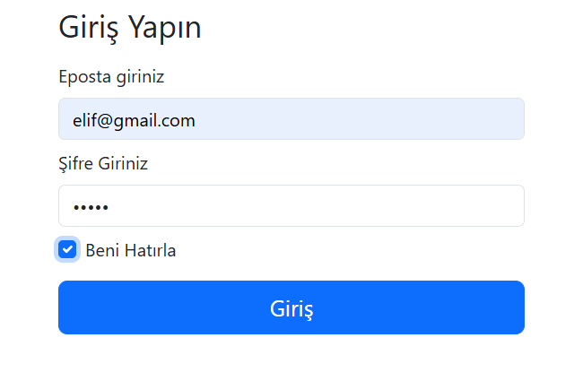
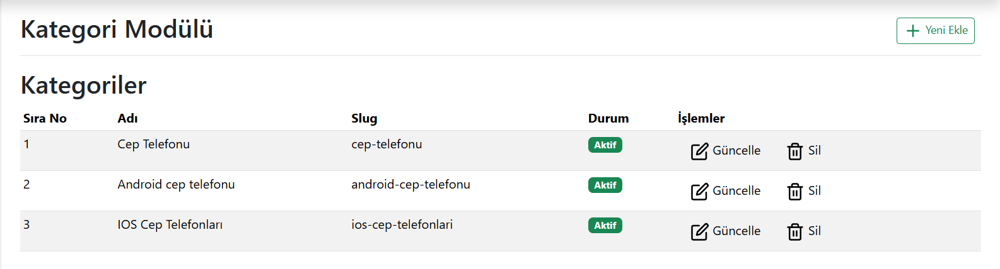
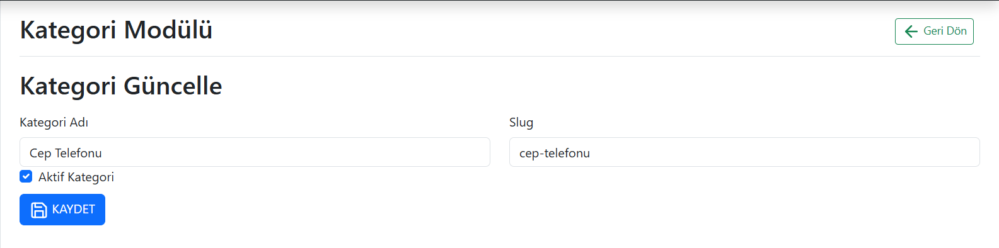
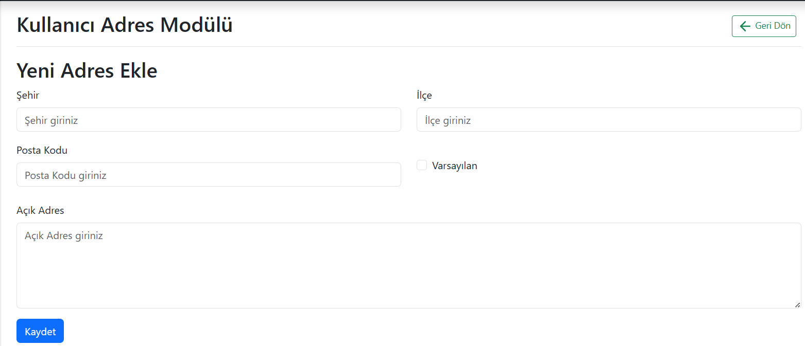
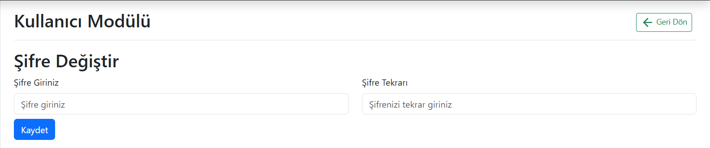
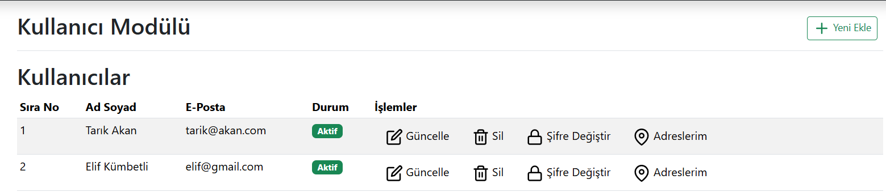
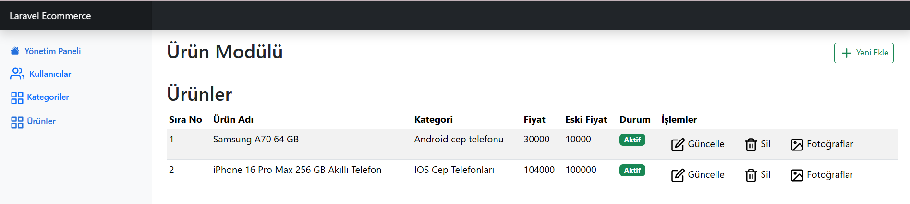
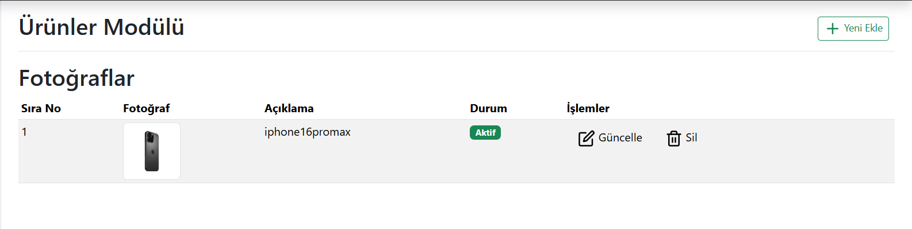
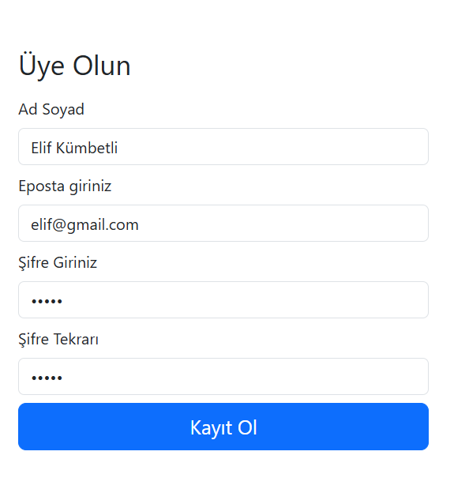

# 🛒 Laravel 11 E-Ticaret Projesi | İyzico Entegrasyonlu

Bu proje, **Laravel 11** kullanılarak geliştirilmiş bir e-ticaret platformudur. Kullanıcılar sisteme üye olabilir, ürünleri görüntüleyip sepete ekleyebilir ve **İyzico ödeme sistemi** ile güvenli bir şekilde alışveriş yapabilir.

## 📌 Proje Hakkında

Proje, **monolitik mimari** ile tasarlanmış, MVC (Model-View-Controller) yapısına uygun olarak yapılandırılmıştır. Kullanıcı dostu arayüzü, yönetim paneli ve ödeme sistemi ile gerçek bir e-ticaret deneyimi sunmayı amaçlamaktadır.

Bu projede kullanıcılar:

-   Üye olabilir veya sistemden çıkabilir,
-   Ürünleri detaylı şekilde görüntüleyebilir,
-   Sepete ürün ekleyebilir ve çıkarabilir,
-   Güvenli ödeme adımıyla alışverişini tamamlayabilir.

Yönetici ise:

-   Kategori ve ürünleri yönetebilir,
-   Kullanıcı bilgilerini görebilir,
-   Ürün görsellerini sisteme yükleyebilir.

## ✨ Özellikler

-   ✅ Kullanıcı kayıt ve giriş sistemi
-   🛍️ Ürün listeleme ve detay sayfaları
-   🧺 Sepet yönetimi
-   💳 İyzico ile güvenli ödeme entegrasyonu
-   🛠️ Admin paneli üzerinden ürün ve kategori yönetimi
-   📷 Ürün görseli ekleyebilme
-   📱 Duyarlı (responsive) tasarım
-   🧱 MVC mimarisi ile temiz ve sürdürülebilir kod yapısı

## 🛠 Kullanılan Teknolojiler

-   **Laravel 11**
-   **PHP 8+**
-   **MySQL**
-   **Bootstrap**
-   **Docker**
-   **Composer**
-   **NPM**

## 🖼️ Ekran Görüntüleri

Proje arayüzünden bazı örnek ekranlar:

-   **Giriş Yap Ekranı**  
    

-   **Kategori Modülü**  
    

-   **Kategori Modülü - Güncelleme**  
    

-   **Kullanıcı Adres Modülü - Adres Ekle**  
    

-   **Kullanıcı Modülü - Şifre Değiştirme**  
    

-   **Kullanıcı Modülü**  
    

-   **Satın Alma Sayfası**  
    

-   **Sepetim**  
    

-   **Ürün Ekleme Ekranı**  
    

-   **Ürün Modülü**  
    

-   **Ürün Modülü - Fotoğraf Ekleme**  
    

-   **Üye Ol Ekranı**  
    

## 🧩 Proje Yapısı

Projede Laravel’in standart klasör yapısı kullanılmıştır:

```plaintext
├── app/                 # Uygulama temel kodları (Controllers, Models, Policies)
│   ├── Http/
│   │   ├── Controllers/  # Controller dosyaları
│   │   └── Middleware/
│   ├── Models/           # Veri modelleri
│   └── ...
├── bootstrap/           # Laravel başlangıç ayarları
├── config/              # Uygulama konfigürasyon dosyaları
├── database/            # Migration, Seeder ve factory dosyaları
├── public/              # Public erişim için dosyalar (CSS, JS, resimler)
├── resources/           # Blade şablonları (views), dil dosyaları, Sass, JS kaynakları
│   ├── views/           # Blade template dosyaları (frontend ve backend)
│   └── ...
├── routes/              # Uygulama rotaları (web.php, api.php)
├── storage/             # Log, cache, dosya uploadları
├── tests/               # Test dosyaları
├── vendor/              # Composer bağımlılıkları
├── docker-compose.yml   # Docker yapılandırması
├── Dockerfile           # Docker image yapılandırması
├── composer.json        # PHP bağımlılıkları
├── package.json         # NPM bağımlılıkları
└── artisan              # Laravel komut satırı aracı
```
